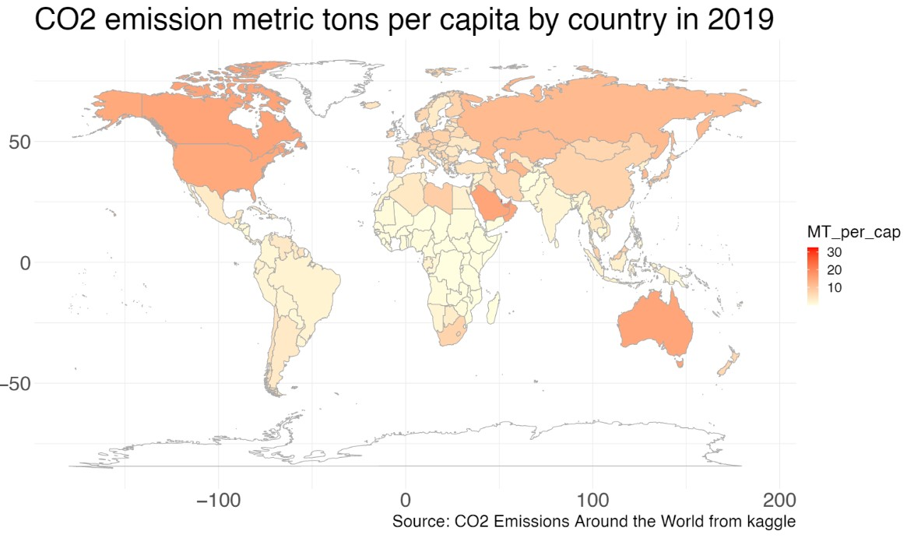

# Bootcamp Projects

Data science bootcamp 6 with adToy(Data Rookie)🐤

We learn 10 sprints during 4 month program.

- [x] 📄 Spreadsheets
- [x] 🌐 SQL Database 
   - **Restaurant owners :**   *Design and Create restaurant database, Built data model and use SQL to query data for analysis*  
   -> https://replit.com/@Phawatken/SQLhomeworkbatch6?v=1
- [x] 📘 R Programming
   - **Chatbot to order pizza 🤖🍕:**   *Written in R programming language*  
   -> https://replit.com/@Phawatken/Batch06HW01ChatbotPizza?v=1
   - **PaoYingShub game**👊✌🖐 
   -> https://replit.com/@Phawatken/Batch06HW02PaoYingShub?v=1
- [x] 🖥️ Data Transformation
   - **NYC flights 2013✈️ :** *Exploring nycflights13 using basic data manipulation with dplyr/tidyverse*  
   -> https://datalore.jetbrains.com/view/notebook/baBv6pR9u1nsRCXSeqSOHK
- [x] 📊 Data Visualization
   - **Analyze CO2 emission** (dataset from kaggle)  
   -> [Project Data Visualization](./DataVisualization_CO2.pdf)  
       
- [ ] 📈 Statistics
- [x] 👨‍💻 Intro to "Classical" Machine Learning
- [x] 🐍 Essential Python for Data Analyst
   - **PaoYingShub game** (in Python)👊✌🖐 and **ATM class (OOP)🏧** 
   -> https://datalore.jetbrains.com/view/notebook/f8wlarSuUNozy5TwhPFi6R
   - **Analyzing Sales Data:** *with Pandas library*  
   -> https://datalore.jetbrains.com/view/notebook/t9DtWRd2bvFOfSP1Q5wQsz
   - **GET API:** *get Pokemon API and bulid the dataframe.*  
   -> https://datalore.jetbrains.com/view/notebook/Qqbk2j9lWlXCQeCLyQjky4
   - [ ]**Build simple ML model**
- [x] 💹 Dashboard
   - **Worldwide meat consumption 🥩** by Data studio(looker) 
   -> https://datastudio.google.com/reporting/cd55e70c-4a55-4f20-afc6-57201b71f375/page/p_2lcqa7xf1c
   - **Global Shark Attacks 🦈** by Tableau  
   -> https://public.tableau.com/app/profile/kanephawat/viz/GlobalSharkAttacks_16710075249910/Dashboard1
